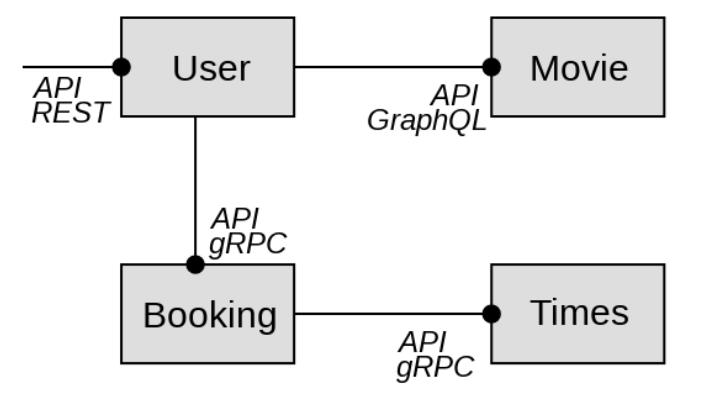

# UE-AD-A1-MIXTE

# Gestion de Salle de Cinéma

Ce projet est une application de gestion de salle de cinéma, permettant la gestion des films, des séances, des réservations et des salles. 

## Fonctionnalités

- Gestion des films : Ajouter, modifier, supprimer des films
- Gestion des séances : Planifier les horaires et les salles
- Gestion des réservations : Réserver des places pour une séance

## Architecture du projet:
Ce projet utilise une architecture Microservices, et se compose de quatre services:
- User : Gère les opérations liées aux utilisateurs.
- Movie : Gère les informations sur les films.
- Booking : Gère les réservations de films.
- Times : Fournit les informations sur les horaires des films.
  
L'image ci-dessous explique en détail comment se fait la liaison entre ses différents microservices en utilisant différents types d'API:




## Prérequis

Avant de lancer le projet, assurez-vous d'avoir installé les éléments suivants :

- Python et Pip

## Installation et Lancement en Local

Suivez ces étapes pour configurer et lancer le projet en local.

1. **Clonez le dépôt**

   ```bash
   git clone https://github.com/Mehdialaoui02/UE-AD-A1-MIXTE.git
   ```

2. **Installez les dépendanses**

    Assurez vous d'avoir python et pip installés sur votre machine puis lancez :
    ```bash
   pip install -r requirements.txt
   ```
3. **Lancez les serveur**

    Lancez chacune des commande dans un terminal différents :
   - Le serveur movie sur le port 3200
   ```bash 
    cd movie
    python movie.py 
   ``` 
    - Le serveur booking sur le port 3201
    ```bash 
    cd booking
    python booking.py 
   ```
   - Le serveur showtime sur le port 3202
   ```bash 
    cd showtime
    python showtime.py 
   ``` 
   - Le serveur user sur le port 3203
   ```bash 
    cd user
    python user.py 
   ```
   
4. **Testez sur postman**
   - Voici quelques endpoints que vous pouvez testez:
   - GET :
   ```
   http://127.0.0.1:3004/json     : affiche tous les users
   http://127.0.0.1:3004/users/chris_rivers    :     afiche les détails de ce user
   http://127.0.0.1:3004/movie/a8034f44-aee4-44cf-b32c-74cf452aaaae  : afiche les détails des movies ainsi que la liste des acteurs.
   http://127.0.0.1:3004/movie/title/Creed    : affiche les détails d'un film à partir de son titre
   ```
   - POST :
   ```
   - http://127.0.0.1:3004/adduser/new_user2
   body = {"id": "new_user2", "name": "Chris Fouad", "last_active": 1360031010}

   -  http://127.0.0.1:3004/addmovie
   body = {
      "title": "InceptionPart2",
      "rating": 8.6,
      "director": "Christopher Nolan",
      "id": "cool_custom_id_inception"
   }
   ```
   - DELETE :
   ```
   http://127.0.0.1:3004/movie/delete/96798c08-d19b-4986-a05d-7da856efb697
   ```

   - gRPC :
      ```
     - Pour Booking: http://127.0.0.1:3005
          - GetJson : permet d'aficher toutes les réservation
          - GetBookings : permet d'afficher les réservations d'un utilisateur :
               dans ce cas là le body :
                     {
                      "id":"chris_rivers"
                     }
         - AddBooking : permet d'ajouter un booking:
              dans ce cas là le body :
                    {
                    "userid": "1234",
                    "date": "2024-10-23",
                    "movies_id": {
                      "movies_id": [
                        "movie_1",
                        "movie_2",
                        "movie_3"
                      ]
                    }
                  }


       - Pour showtime : http://127.0.0.1:3002
      
          -GetTimes: permet d'afficher tous les dates des diférents movies
          - ShowMovies: permet d'afficher les movies à une telle date :
               - dans ce cas on écrit dans body : {
                                                    "date":"20151130"
                                                   }
       ```    
